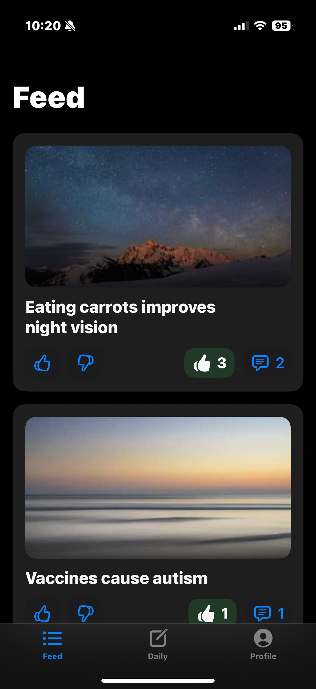
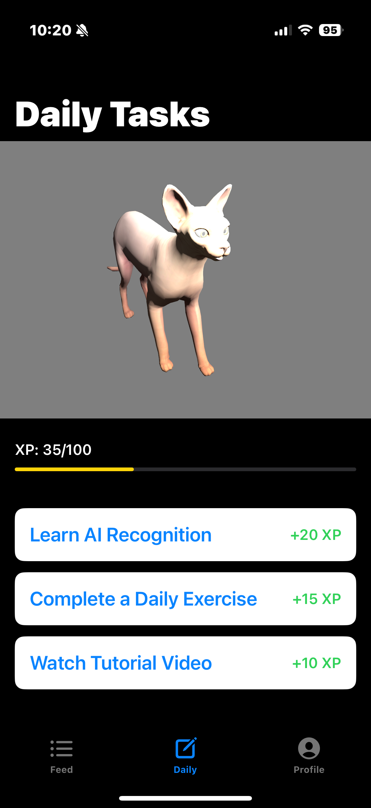
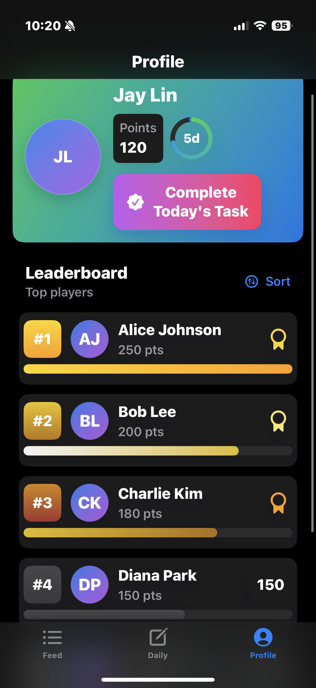

# 🚀 Project Name
  
An AI-power education for recognition built with Swift and Xcode that helps users manage daily tasks with gamification features.

---

## 📱 Features
- ✨ Feature 1 Community Feed Based
- 🎨 Feature 2 Pet Lover and empathy
- 🐱 Feature 3 Gamification for AI recognition education 

---

## 🛠️ Tech Stack
- **Language:** Swift 5
- **Frameworks:** SwiftUI, UIKit (if used), SceneKit
- **Tools:** Xcode 15, CocoaPods/Swift Package Manager
- **Version:** iOS 18
---

## 🚀 Getting Started

### Prerequisites
- macOS (latest recommended)
- [Xcode](https://developer.apple.com/xcode/) (version 15 or above)
- Swift 5

### Installation
1. Clone the repo:
   ```bash
   git clone https://github.com/yourusername/ProjectName.git

## 🎨 Gallery

<p>
  
  
  
</p>

### Reference

- [Cat Model](https://sketchfab.com/3d-models/sphynx-cat-75b24043195a4f32a4a9d9be06f0fb10#download)